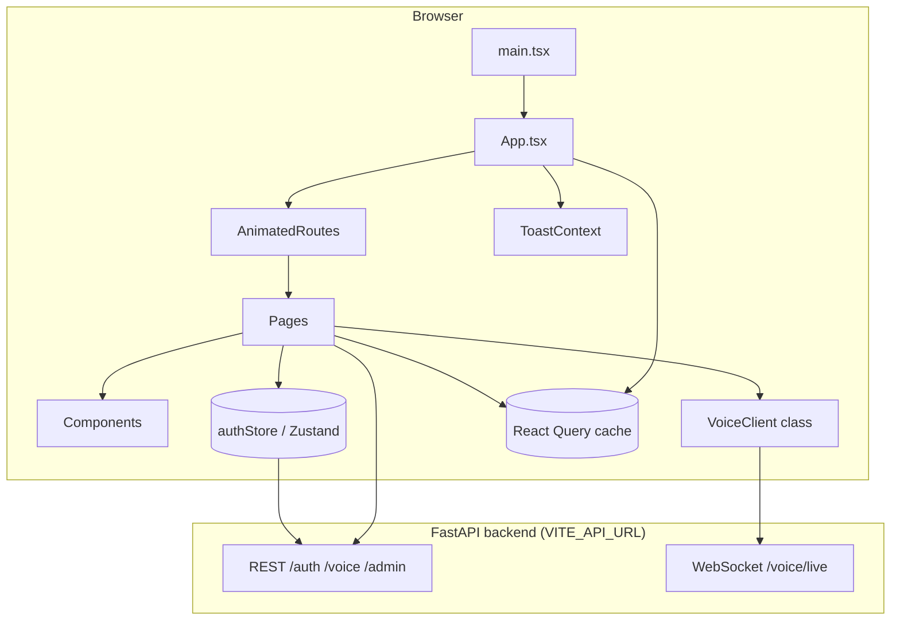
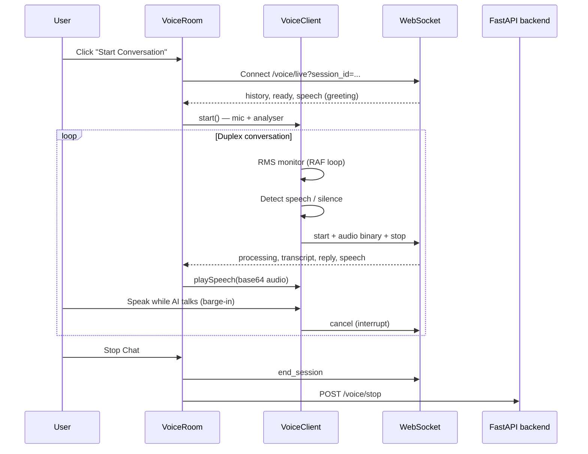

# Aether Knight Frontend

React + TypeScript single-page application for **Aether Knight** — a voice-first AI assistant with real-time duplex conversation, session persistence, and admin user management.

The frontend talks to a separate **FastAPI backend** over REST and WebSockets. This repo contains only the client; the API handles auth, LLM replies, speech-to-text, text-to-speech, and session storage.

---

## Table of contents

- [Features](#features)
- [Tech stack](#tech-stack)
- [Architecture overview](#architecture-overview)
- [Project structure](#project-structure)
- [Application bootstrap](#application-bootstrap)
- [Routing & access control](#routing--access-control)
- [Authentication flow](#authentication-flow)
- [API layer](#api-layer)
- [Voice system](#voice-system)
- [Pages](#pages)
- [UI & visual system](#ui--visual-system)
- [State management](#state-management)
- [Mobile performance](#mobile-performance)
- [Environment variables](#environment-variables)
- [Local development](#local-development)
- [Build & deploy](#build--deploy)
- [Scripts](#scripts)

---

## Features

| Area | What it does |
|------|----------------|
| **Auth** | Register, login, logout with JWT stored in the browser |
| **Home dashboard** | Start new voice chats, resume saved sessions, delete chats with an in-app confirm dialog |
| **Voice room** | Full-duplex voice conversation over WebSocket with barge-in (interrupt the AI while it speaks) |
| **Transcript** | Live log of user/AI/system messages during a session |
| **AI subtitles** | Word-by-word subtitles synced to TTS audio playback |
| **Jarvis orb** | Animated audio-reactive wave visualization |
| **Admin panel** | List, edit, and delete users (admin role only) |
| **Themed backgrounds** | Canvas particle-wave animations per page (auth, home, admin, voice) |
| **Page transitions** | Smooth fade/slide animations between routes |
| **Toasts** | Non-blocking success/error/info notifications |
| **SPA routing** | Deep links (`/login`, `/home`, `/voice/:id`) work on refresh when deployed |

---

## Tech stack

| Layer | Technology |
|-------|------------|
| Framework | React 18 |
| Language | TypeScript 5 |
| Build tool | Vite 6 |
| Routing | React Router 6 |
| Server state | TanStack React Query 5 |
| Client state | Zustand 5 (persisted auth) |
| Styling | Tailwind CSS 3 |
| Fonts | Orbitron (display), Rajdhani (body) |
| Real-time | WebSocket + Web Audio API + MediaRecorder |
| Deployment | Netlify (static `dist/` + SPA redirects) |

---

## Architecture overview

The app is organized in layers: **UI pages** call **API modules** or **VoiceClient**; shared **components** and **context** provide cross-cutting UI; **Zustand** holds auth; **React Query** caches REST responses.



### Data flow summary

1. **Auth** — Login/register returns a JWT; Zustand persists `token` + `user` to `localStorage`. Every REST call attaches `Authorization: Bearer <token>`.
2. **Sessions** — Home page lists chats via `GET /voice/sessions`. Starting or resuming creates a session and navigates to `/voice/:sessionId`.
3. **Voice** — Voice room opens a WebSocket to `/voice/live?session_id=…`. `VoiceClient` captures mic audio, sends binary chunks, receives transcripts/replies/TTS, and supports interrupting the agent mid-speech.
4. **Admin** — Admin-only routes call `/admin/users` CRUD endpoints.

---

## Project structure

```
aether-knight-frontend/
├── public/
│   └── _redirects              # Netlify SPA fallback (/* → /index.html)
├── src/
│   ├── main.tsx                # React entry point
│   ├── App.tsx                 # Providers + router shell
│   ├── index.css               # Global styles, animations, mobile perf CSS
│   ├── vite-env.d.ts
│   │
│   ├── api/                    # REST client modules (no React)
│   │   ├── client.ts           # fetch wrapper, ApiError, wsUrlForSession
│   │   ├── auth.ts             # login, register, me, logout
│   │   ├── voice.ts            # sessions, start, resume, stop, delete
│   │   └── admin.ts            # user list, update, delete
│   │
│   ├── types/
│   │   └── api.ts              # Shared TypeScript interfaces & WS message types
│   │
│   ├── store/
│   │   └── authStore.ts        # JWT + user (Zustand persist)
│   │
│   ├── context/
│   │   └── ToastContext.tsx    # Global toast notifications
│   │
│   ├── hooks/
│   │   └── VoiceClient.ts      # Duplex mic + WebSocket voice engine (class)
│   │
│   ├── utils/
│   │   └── canvasPerf.ts       # Mobile canvas performance helpers
│   │
│   ├── components/             # Reusable UI
│   │   ├── AnimatedRoutes.tsx  # Routes + page-transition wrapper
│   │   ├── AuthBootstrap.tsx   # Validates token on load via GET /auth/me
│   │   ├── ProtectedRoute.tsx  # Requires login
│   │   ├── AdminRoute.tsx      # Requires admin role
│   │   ├── Nav.tsx             # Top nav (cosmic / cyber / jarvis variants)
│   │   ├── ConfirmDialog.tsx   # In-app delete confirmation modal
│   │   ├── ToastContainer.tsx
│   │   ├── AuthBackground.tsx  # Login/register canvas background
│   │   ├── HomeBackground.tsx  # Home dashboard canvas background
│   │   ├── AdminBackground.tsx # Admin panel canvas background
│   │   ├── VoiceBackground.tsx # Voice room canvas background
│   │   ├── JarvisWave.tsx      # Audio-reactive orb visualization
│   │   ├── AiSubtitles.tsx     # TTS-synced word reveal
│   │   └── TranscriptPanel.tsx # Scrollable conversation log
│   │
│   └── pages/
│       ├── Login.tsx
│       ├── Register.tsx
│       ├── Home.tsx
│       ├── VoiceRoom.tsx
│       └── Admin.tsx
│
├── index.html
├── vite.config.ts              # @ path alias → src/
├── tailwind.config.js
├── netlify.toml                # Build + SPA redirect
├── .env.example
└── package.json
```

---

## Application bootstrap

Boot order in `main.tsx` → `App.tsx`:

```
main.tsx
  └── App.tsx
        ├── QueryClientProvider     # REST caching & mutations
        ├── ToastProvider           # showToast() anywhere
        ├── AuthBootstrap           # Re-validates JWT on startup
        ├── BrowserRouter
        │     └── AnimatedRoutes    # All page routes
        └── ToastContainer          # Renders toast stack
```

**`AuthBootstrap`** — If a token exists in storage, calls `GET /auth/me`. On failure (expired/invalid token), clears auth so the user is sent back to login.

**`AnimatedRoutes`** — Wraps the active route in a `page-transition` div keyed by `location.pathname` so route changes animate smoothly.

---

## Routing & access control

| Path | Page | Access |
|------|------|--------|
| `/login` | Login | Public (redirects to `/home` if already logged in) |
| `/register` | Register | Public |
| `/` | Redirect → `/home` | Authenticated |
| `/home` | Dashboard | Authenticated |
| `/voice/:sessionId` | Voice room | Authenticated |
| `/admin` | User management | Admin only |
| `*` | Redirect → `/home` | — |

**`ProtectedRoute`** — Reads `token` from `authStore`. No token → `<Navigate to="/login" />`. Otherwise renders `<Outlet />` for child routes.

**`AdminRoute`** — Nested inside `ProtectedRoute`. Checks `user.role === "admin"`. Non-admins are redirected to `/home` with a toast.

---

## Authentication flow

```
Register/Login form
       │
       ▼
POST /auth/register  or  POST /auth/login
       │
       ▼
{ token, user }  →  authStore.setAuth()
       │
       ▼
Persisted to localStorage (key: aether-knight-auth)
       │
       ▼
Navigate to /home
```

- **Logout** — `POST /auth/logout` then `clearAuth()` and redirect to `/login`.
- **API auth** — `api/client.ts` reads the token from Zustand on every request and sets the `Authorization` header.
- **Roles** — `user` | `admin`. Admin link on Home is shown only when `user.role === "admin"`.

---

## API layer

All HTTP traffic goes through `apiRequest<T>()` in `src/api/client.ts`.

### Design

- Base URL from `VITE_API_URL` (default `http://127.0.0.1:8000`)
- JSON request/response with envelope shape `{ success, message?, data? }`
- Throws `ApiError` with HTTP status on failure
- Parses FastAPI-style `detail` arrays for validation errors

### Modules

| Module | Endpoints | Used by |
|--------|-----------|---------|
| `auth.ts` | `POST /auth/login`, `POST /auth/register`, `GET /auth/me`, `POST /auth/logout` | Login, Register, Nav, AuthBootstrap |
| `voice.ts` | `POST /voice/start`, `POST /voice/resume`, `GET /voice/sessions`, `GET /voice/sessions/:id`, `DELETE /voice/sessions/:id`, `POST /voice/stop` | Home, VoiceRoom |
| `admin.ts` | `GET /admin/users`, `PUT /admin/users/:id`, `DELETE /admin/users/:id` | Admin |

### WebSocket URL

```ts
wsUrlForSession(sessionId)
// → ws://<host>/voice/live?session_id=<id>
```

Derived from `VITE_API_URL` by replacing `http` with `ws`.

---

## Voice system

The voice experience is the most complex part of the architecture. It combines **VoiceRoom** (React UI + WebSocket handler) and **VoiceClient** (audio engine).

### High-level flow



### VoiceClient (`src/hooks/VoiceClient.ts`)

A standalone class (not a React hook) ported from the backend’s `voice_client.js`. Responsibilities:

| Responsibility | Implementation |
|----------------|----------------|
| Microphone | `getUserMedia` with echo cancellation |
| Level metering | `AudioContext` + `AnalyserNode`, RMS via `requestAnimationFrame` |
| Noise calibration | ~1.2s quiet period to set noise floor |
| Utterance detection | Speech above threshold → record; 1s silence → send |
| Recording | `MediaRecorder` (webm/opus), 250ms chunks |
| Upload | WS messages: `{type:"start"}`, binary audio, `{type:"stop"}` |
| Barge-in | While AI speaks, sustained loud input triggers `cancel` + new recording |
| TTS playback | Decodes base64 audio into `HTMLAudioElement`, exposes to UI |
| Session end | `requestEnd()` → `{type:"end_session"}` on WebSocket |

**Key constants:** 1s silence to end utterance, 700ms minimum speech, 22s max recording, interrupt hold 500ms.

### VoiceRoom (`src/pages/VoiceRoom.tsx`)

Orchestrates the session UI:

- Opens WebSocket when user clicks **Start Conversation**
- Instantiates `VoiceClient` with callbacks for log, status, and audio element
- Parses `WsServerMessage` union types from `types/api.ts`
- Handles `history` (resumed chats), `transcript`, `reply`, `speech`, `title_updated`, `session_ended`, `error`
- Renders `JarvisWave`, `AiSubtitles`, `TranscriptPanel`
- Calls `POST /voice/stop` when session ends

### WebSocket message types (server → client)

| Type | Purpose |
|------|---------|
| `ready` | Session ready; includes user name and resumed flag |
| `history` | Previous messages when resuming a chat |
| `listening` | Mic ready |
| `processing` | AI is thinking |
| `transcript` | STT result from user audio |
| `reply` | Text reply (before TTS) |
| `speech` | TTS text + base64 audio |
| `title_updated` | Auto-generated chat title |
| `session_ended` | Conversation saved / ended |
| `error` | Server error message |

---

## Pages

### Login & Register

- Wrapped in `AuthBackground` (cyan → red particle waves)
- Forms use React Query mutations
- On success: store auth, toast, navigate to `/home`

### Home

- Wrapped in `HomeBackground` (orange → purple cosmic theme)
- Lists saved voice sessions from React Query (`queryKey: ["voice-sessions"]`)
- **New Voice Chat** → `POST /voice/start` → navigate to `/voice/:sessionId`
- **Resume** → `POST /voice/resume`
- **Delete** → `ConfirmDialog` modal → `DELETE /voice/sessions/:id`

### Voice Room

- Full-screen `VoiceBackground` + header with back link and **Stop Chat**
- States: `idle` → connect → `calibrating` → `listening` → `recording` → `processing` → `speaking`
- Transcript panel shows user, AI, and system lines

### Admin

- Wrapped in `AdminBackground` (cyan/teal → amber cyber theme)
- User table with edit modal and delete (still uses browser `confirm` for user delete)
- Edit form: name, email, role, optional password

---

## UI & visual system

### Themed canvas backgrounds

Four full-screen `<canvas>` components render animated particle waves via `requestAnimationFrame`:

| Component | Pages | Color theme |
|-----------|-------|-------------|
| `AuthBackground` | Login, Register | Cyan → red |
| `HomeBackground` | Home | Orange → purple |
| `AdminBackground` | Admin | Cyan/teal → amber + glitch scan lines (desktop) |
| `VoiceBackground` | Voice room | Purple nebula particles |

Shared engine pattern: sine-wave particle grid, ambient glow pools, bokeh orbs (desktop), vignette, `flow = t * 1.8`.

### JarvisWave

Canvas orb with 8 layered stroked waves (4 on mobile). Uses Web Audio `AnalyserNode` on the TTS `HTMLAudioElement` to drive amplitude when the agent is speaking.

### Nav variants

| Variant | Used on | Style |
|---------|---------|-------|
| `cosmic` | Home | Purple/orange gradient title |
| `cyber` | Admin | Cyan/amber gradient title |
| `jarvis` | (available) | Cyan monospace aesthetic |

### ConfirmDialog

Reusable modal for destructive actions. Cosmic/cyber variants, backdrop blur, escape/outside-click to cancel, loading state on confirm.

### Global CSS (`index.css`)

- Page transition keyframes (`page-transition-in`)
- Button glow pulses (`home-glow-btn`, `admin-glow-btn`)
- Subtitle word animation
- **Mobile overrides** (`max-width: 767px`): lighter transitions, no backdrop-blur, no infinite glow animations

---

## State management

| Concern | Tool | Location |
|---------|------|----------|
| Auth token & user | Zustand + persist | `store/authStore.ts` |
| Session list, mutations | React Query | `pages/Home.tsx`, `pages/Admin.tsx` |
| Voice room UI state | React `useState` | `pages/VoiceRoom.tsx` |
| Toasts | React Context | `context/ToastContext.tsx` |
| Voice audio engine | Class instance in ref | `voiceRef` in VoiceRoom |

React Query defaults (`App.tsx`): `retry: 1`, `refetchOnWindowFocus: false`.

---

## Mobile performance

Phone GPUs struggle with full-resolution canvas + backdrop-blur. Optimizations live in `src/utils/canvasPerf.ts` and `index.css`:

| Optimization | Mobile behavior |
|--------------|-----------------|
| Device pixel ratio | Capped at 1 |
| Particle grid | ~60% fewer particles |
| Frame rate | 30 FPS (vs ~55 on desktop) |
| Bokeh / crests / glitch lines | Skipped |
| Tab hidden | Animations paused |
| JarvisWave | 4 layers, 72 segments, no shadow blur |
| Backdrop blur | Disabled via CSS |
| Page transitions | No blur, shorter animation |
| AiSubtitles | Throttled word updates |

---

## Environment variables

Copy `.env.example` to `.env`:

```bash
cp .env.example .env
```

| Variable | Description | Example |
|----------|-------------|---------|
| `VITE_API_URL` | Backend base URL (REST + WS) | `http://127.0.0.1:8000` |

Vite only exposes variables prefixed with `VITE_`. Set the production API URL in Netlify environment settings before deploy.

---

## Local development

**Prerequisites:** Node.js 18+, npm, running Aether Knight backend.

```bash
cp .env.example .env
# Edit .env if your API is not on localhost:8000

npm install
npm run dev
```

App: **http://localhost:5173**

The backend must be reachable at `VITE_API_URL`. Voice features require HTTPS or localhost for microphone permissions.

---

## Build & deploy

### Production build

```bash
npm run build
```

Runs TypeScript check (`tsc --noEmit`) then Vite build. Output: `dist/`.

Preview locally:

```bash
npm run preview
```

### Netlify

1. Connect this repository to Netlify.
2. Build settings (from `netlify.toml`):
   - **Build command:** `npm run build`
   - **Publish directory:** `dist`
   - **Base directory:** *(leave empty — project root)*
3. Set environment variable: `VITE_API_URL` = your production API URL.
4. Deploy.

SPA routing is handled by:

- `netlify.toml` — `/* → /index.html` (200)
- `public/_redirects` — same rule, copied into `dist/` on build

This ensures `/login`, `/home`, `/voice/abc`, etc. work when refreshed or opened directly.

---

## Scripts

| Command | Description |
|---------|-------------|
| `npm run dev` | Start Vite dev server (port 5173) |
| `npm run build` | Typecheck + production build to `dist/` |
| `npm run preview` | Serve production build locally |
| `npm run lint` | Run ESLint |

---

## Path alias

`@/` maps to `src/` (configured in `vite.config.ts`):

```ts
import { useAuthStore } from "@/store/authStore";
```

---

## Related backend

This frontend expects a compatible FastAPI backend providing:

- JWT auth under `/auth/*`
- Voice sessions under `/voice/*`
- Admin CRUD under `/admin/users`
- Live duplex voice at `WS /voice/live?session_id=...`

Ensure CORS and WebSocket origins allow your frontend domain in production.
